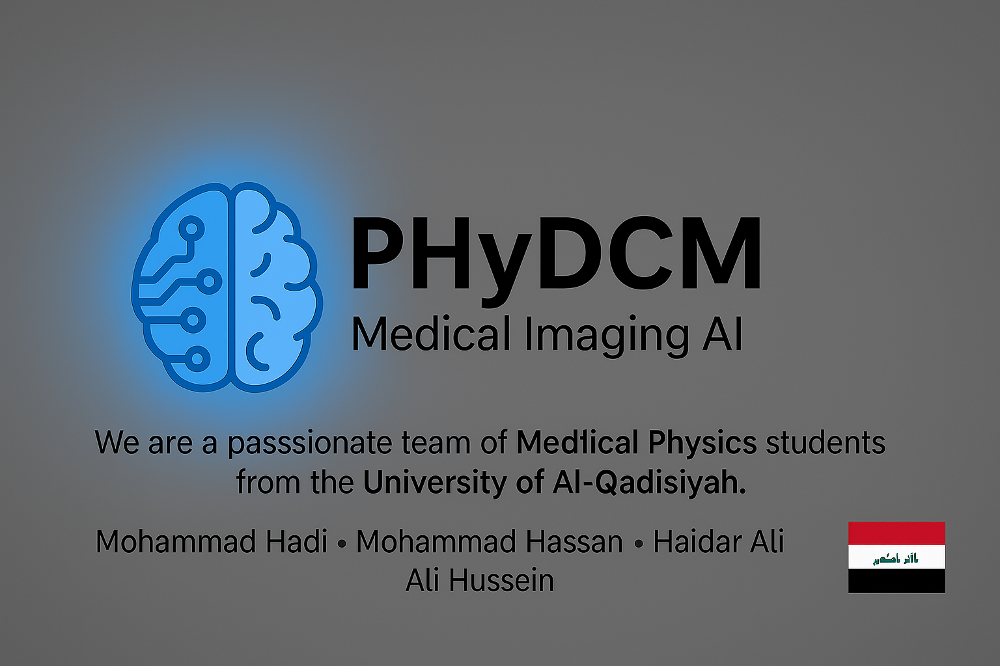
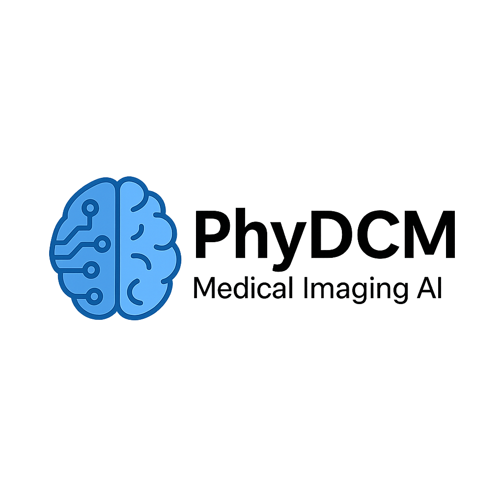

# PhyDCM - Medical Imaging AI



**PhyDCM** is a research-driven project developed by a passionate team of Medical Physics students from the University of Al-Qadisiyah.  
Our aim is to create cutting-edge tools that utilize artificial intelligence to enhance medical image processing and analysis.

---

## 👨‍🔬 Team Members

- **Mohammed Hadi**
- **Mohammed Hassan**
- **Haider Ali**
- **Ali Hussein**

Department of Medical Physics – University of Al-Qadisiyah

---

## 🧠 Project Vision

To build smart, accessible software tools that assist doctors and radiologists in analyzing DICOM medical images, using interactive visualization and AI-based diagnostics.

---

## 📷 Logo



---

## 📂 Features

- DICOM viewer with interactive video browsing.
- Multi-modality support: CT, MRI, PET.
- AI-ready design for segmentation and classification.
- Clean, user-friendly UI.

---

## 🚀 Getting Started

1. Clone the repo
2. Install requirements
3. Run the app

---

## 📦 Installation via pip

```bash
pip install phydcm
